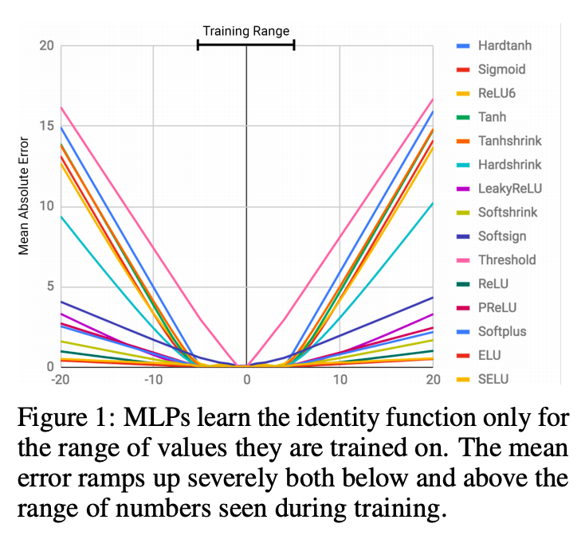
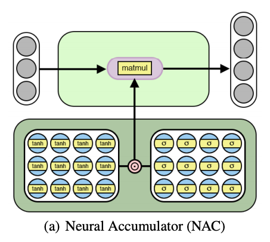
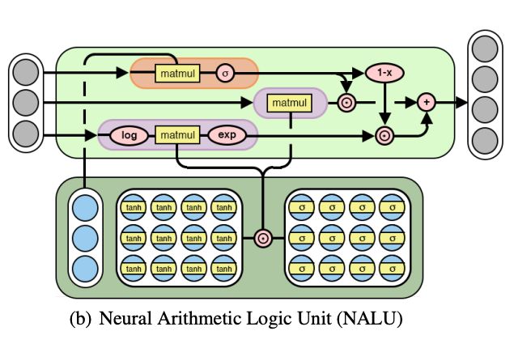

## Premise
The [paper](https://arxiv.org/pdf/1808.00508.pdf) addresses the problem that traditional Neural Networks face in generalising when faced with data well outside the range of the data they were trained on. Hence, the authors propose two architectures, the Neural Accumulator (abbr. NAC) and the Neural ALU (abbr. NALU) to generalise on testing data for basic arithmetic operations like Addition, Subtraction, Multiplication and Division.  

## Problem
Traditional neural networks had very poor performance when faced with data well outside the range of the data they were trained on. 

They trained an autoencoder to learn the identity function between -5 to 5, and tested it between -20 to +20. Here are the results for a variety of different non-linear activations:

The authors suggest some reasons for this failure:
>The severity of this failure directly corresponds to the degree of non-linearity within the chosen activation function. Some activations learn to be highly linear (such as PReLU) which reduces error somewhat, but sharply non-linear functions such as sigmoid and tanh fail consistently.

## Method
The main idea is to restrict the weights to belong to the set {-1, 0, 1}. This ensures that the output of a layer is the addition (or subtraction) of the rows of its input. But, this cannot happen as the weight updates have to be differentiable. So, they introduce a special type of weight matrix W, so that the weights take on continuous values, but be biased towards the set's elements.

### Neural Accumulator

This is for addition (or subtraction) only. It employs a hadamard product of tanh and sigmoid so as to restrict the weights between -1 and 1, and bias them towards {-1, 0, 1} respectively.

<b>W</b> = tanh(<b>W&#770;</b>) &#8857; &sigma;(<b>A&#770;</b>)

The weight matrix has been split into two parameters now, as a result. The structure of the NAC is as follows:

### Neural Arithmetic Logic Unit
This is the complete package. It can perform all basic arithmetic operations like addition, subtraction, multiplication and division. It employs a normal NAC for addition, subtraction; but for multiplication (or division), it exponentiates the addition (or subtraction) of the logarithms (natural) of the input rows. Effectively, this leads to the multiplication or division of input rows.

NAC output:    <b>a</b> = <b>W</b>x

<b>m</b> = exp <b>W</b> (log(|<b>x</b>| + &isin;))

Here, &isin; is for numerical stability.
Also, to switch between operations, NALU has a sigmoid gate:

<b>g</b> = &sigma;(<b>G</b>x)

NALU output:    <b>y</b> = <b>g</b> &#8857; <b>a</b> + (1 - <b>g</b>) &#8857; <b>m</b>

## Pros
- Better <b>extrapolation ability</b> in simple function learning tasks.
- Better Language to Number Translation ability.
- Provides a good design strategy to create models that have biases for a target class of <b>functions</b>, rather than input values.

## Cons
- Weights are able to get increasingly close to zero, as a result learning slows down.
- Extrapolation Ability for Division is very low, because of weights being close to zero.
- Not yet perfect for every task

## Recent Works
Andreas Masden et al. published a paper in ICLR 2020 named "Neural Arithmetic Units". This was a step forward towards improving root defects in the strategy proposed in this paper. NAU doesn't support division yet though.

