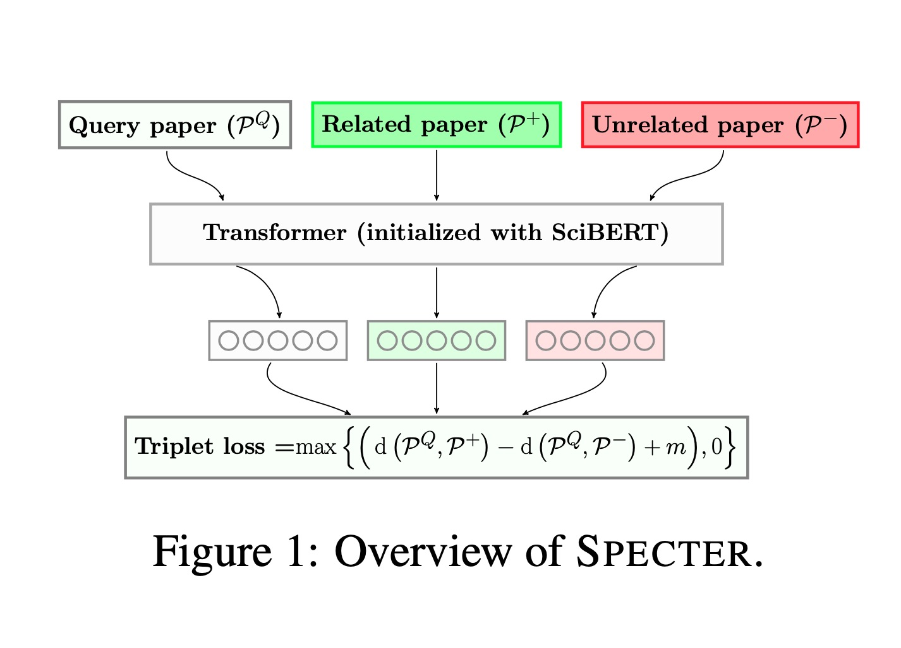
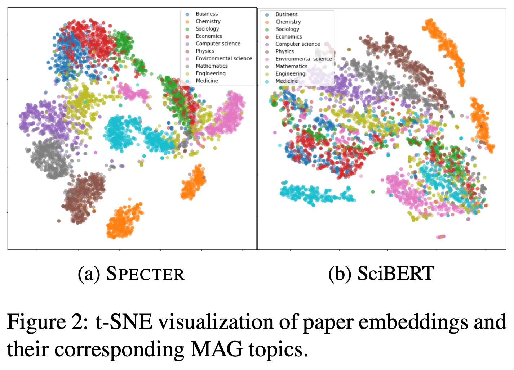

Our goal is to represent a given paper (scientific publication) `P` as a dense vector `v` that best represents the paper and can be used in downstream tasks.

  

## Introduction
[SPECTER (Scientific Paper Embeddings using Citation informed TransformERs)](https://arxiv.org/pdf/2004.07180.pdf) is yet another BERT inspired paper by AllenAI attempting to solve the problem of generating document-level embedding of scientific documents based on pretraining a Transformer language model on a powerful signal of document-level relatedness i.e a Citation Graph.

In short it leverages the power of pretrained language models to learn embeddings for scientific documents.

## Past problems and Need? 
In recent years, substantial improvements in NLP tools have been brought about by pretrained neural language models (LMs). While such models are widely used for representing individual words or sentences, extensions to whole-document embeddings are relatively underexplored.
Likewise, methods that do use inter-document signals to produce whole-document embeddings (Tu et al., 2017; Chen et al., 2019) have yet to incorporate state-of-the-art pretrained LMs.

* A paper’s title and abstract provide rich semantic content about the paper, but, simply passing these textual fields to an “off-the-shelf” pretrained language model, even a state-of-the-art model like SciBERT does not result in accurate paper representations.

* The language modeling objectives used to pretrain the model do not lead it to output representations that are helpful for document-level tasks such as topic classification or recommendation. Existing LMs and transformer models such as BERT,SCIBERT etc. are primarily based on masked language modeling objective, only considering intra-document context and do not use any inter-document information. **Reason**: The objective involves only to predict words or sentences given their in-document, nearby textual context.

* These pretrained language models work somewhat decently on downstream applications only after task-specific fine-tuning. 

## Method

To learn high-quality document-level representations we propose using citations as an inter-document relatedness signal and formu- late it as a triplet loss learning objective. We then pretrain the model on a large corpus of citations using this objective, encouraging it to output rep- resentations that are more similar for papers that share a citation link than for those that do not.

SciBERT an adaptation of the original BERT architecture to the scientific domain is used as the foundation for SPECTER.

The final hidden state associated with the special [CLS] token is usually called the “pooled output”, and is commonly used as an aggregate representation of the sequence.

SPECTER builds embeddings from the title and abstract of a paper. Intuitively, this should be sufficient to produce accurate
embeddings, since they are written to provide a succinct and comprehensive summary of the paper.

The idea is to design a loss function that trains the Transformer model to learn closer representations for papers when one cites the other, and more distant representations otherwise. This is achieved by a Triplet Margin Loss objective.

  

### Steps

1. **Encoding**: Encode the **concatenated title and abstract** using a Transformer LM (e.g., SciBERT) and take the final representation of the [CLS] token as the output representation of the paper.
2. **Loss Formulation**: In particular, each training instance is a triplet of papers: a query paper PQ, a positive paper `P+` and a negative paper `P−`. See [paper](https://arxiv.org/pdf/2004.07180.pdf) for the loss formula.
    1. **Selecting Positives**: The positive paper is a paper that the query paper cites, and the negative paper is a paper that is not cited by the query paper (but that may be cited by P+).
    1. **Selecting Negative Distractors**: This is done in 2 ways.
One is to generate negative samples that simply consist of randomly selected papers from the corpus. **But, random negatives may be easy for the model to distinguish from the positives.**. To provide a more nuanced training signal, we can augment the randomly drawn negatives with a more challenging second set of negative examples. These are denoted as **“hard negatives”** the papers that are not cited by the query paper, but are cited by a paper cited by the query paper, i.e. if P1 −−→ P2 and P2 −−→ P3 butP1 −−̸→P3, then P3 is a candidate hard negative.

## Key Contributions
- Incorporate Citations as a naturally occurring inter-document supervision signal to capture document similarity and relatedness.

- For inference, SPECTER requires only the title and abstract of the given input paper; the model does not need any citation information about the input paper. This means that SPECTER can produce embeddings even for new papers that have yet to be cited, which is critical for applications that target recent scientific papers.

- Introduction of SciDocs Dataset

- SPECTER’s representations substantially outperform the state-of-the-
art on a variety of document-level tasks, including topic classification, citation prediction, and recommendation.

- “Unlike most existing LMs that are “fine-tuning based”, this approach results in embeddings that can be applied to downstream tasks in a “feature-based” fashion, meaning the learned paper embeddings can be easily used as features, with no need for further task-specific fine-tuning.

## Future Work
- Develop better multitask approaches to leverage multiple signals of relatedness information during training.

- Use somewhat stronger and larger transformer backbone than SCIBERT, like the GPT-3 etc.
