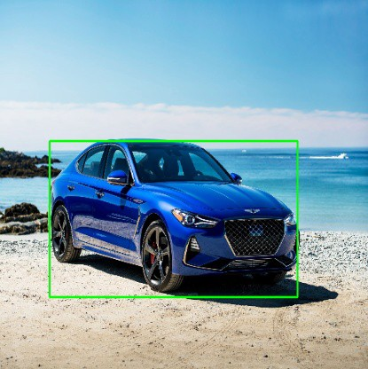
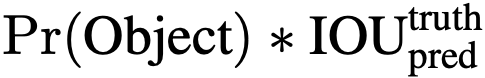
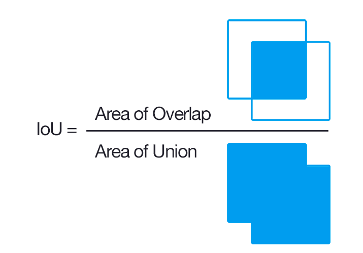
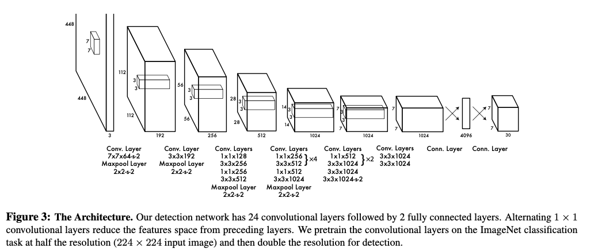
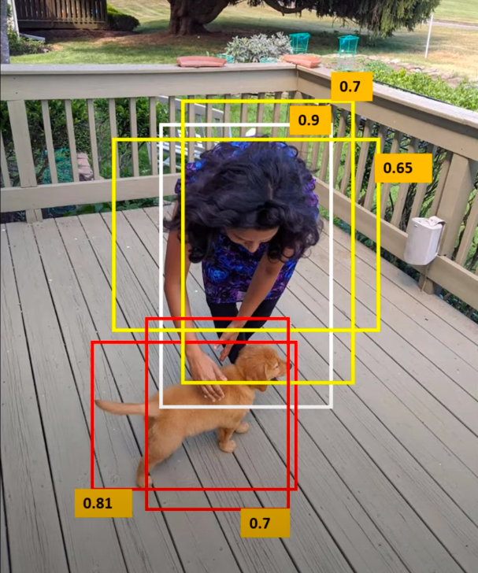
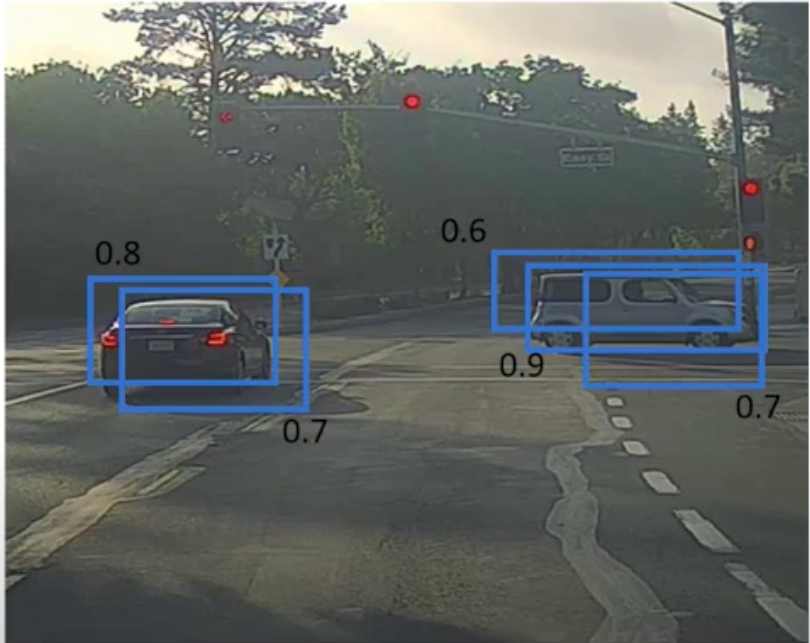

# YOLO: You Only Look Once
## Abstract
YOLO is a new approach to real-time unified object detetction. Object detetction before YOLO employed classifiers for object detection. But here, object detection is reframed as a simple regression problem to spatially separated bounding boxes and associated class probabilities. YOLO learns very general representations of objects, outperforming other de- tection methods, including DPM and R-CNN.

## Introduction
- Systems like deformable parts models (DPM) use a sliding window approach where the classifier is run at evenly spaced locations over the entire image.<br><br>


- R-CNNs use region proposal methods to generate potential bounding boxes in an image and run classifiers on those propsed boxes. But here, post processing is slow and hard to optimize, as individual components are needed to be trained separately.<br><br>

- **Benefits of using YOLO**
    - A single convolutional network simultaneously predicts multiple bounding boxes and class probabilities for those boxes. (Hence object detetction is **unified**.)
    - YOLO trains on full images and directly optimizes detection performance.
    - Extremely fast. Since we frame detection as a regression problem we don’t need a complex pipeline. We simply run our neural network on a new image at test time to predict detections.
    - Achieves more than twice the mean average precision of other real-time systems.
    - YOLO sees the entire image during training and test time so it implicitly encodes contextual information about classes as well as their appearance, and hence background error are reduced considerable.
    - Learns generalizable representations of objects, and is very unlikely to breakdown when applied to unexpected inputs.

## Unified Detection
- The system divides the iput image into an _S×S_ grid.
- If the center of an object falls into a grid cell, that grid cell is responsible for detecting that object.
- Each grid cell predicts _B_ bounding boxes and confidence scores of those boxes.
- Formally, confidence is defined as:<br>
- `IOU` stands for `Intersection over Union`.<br>
- Each bounding box has 5 predictions:
``` 
    1. x, y = coordinates of centre of the object with respect to the grid cell
    2. w, h = width and height of the bounding box, with respect to the entire image
    3. C = confidence
```
- Each grid cell also predicts C conditional class probabilities: Pr(Class<sub>i</sub> |Object). <br>
**Pr(Class<sub>i</sub> |Object) ∗ Pr(Object) ∗ IOU<sup>truth</sup><sub>pred</sub> = Pr(Class<sub>i</sub>) ∗ IOU<sup>truth</sup><sub>pred</sub>**
- Predictions are encoded in an `S × S × (B * 5 + C)` tensor.

## Network Design
- The paper evaluates this network on `PASCAL VOC` detection dataset.
- The network has 24 convolutional layers followed by 2 fully connected layers.
- Instead of the inception modules used by `GoogLeNet`, they simply use 1 × 1 reduction layers followed by 3 × 3 convolutional layers.
- Fast YOLO uses a neural network with fewer convolutional layers (9 instead of 24) and fewer filters in those layers.
- The final output of the network is a `7 × 7 × 30` tensor of predictions.

## Training
- The convolutional layers of the architecture are trained on the `ImageNet 1000-class` competition dataset. 
- The loss from bounding box coordinate predictions is increased and the loss from confidence predictions for boxes that don’t contain objects is decreased to avoid model instabilty during early epochs of training. 
- The prediction with the highest current `IOU` with the ground truth is responsible for predicting that object.<br><br>

## Inference
- Predicting detections for a test image only requires one network evaluation.
- Some large objects or objects near the border of multiple cells can be well localized by multiple cells.
- [Non-maximal suppression](https://towardsdatascience.com/non-maximum-suppression-nms-93ce178e177c) can be used to fix these multiple detections.<br><br>  
- Comparisons with other object detetction algorithms can be seen [here](https://arxiv.org/pdf/1506.02640v5.pdf).


