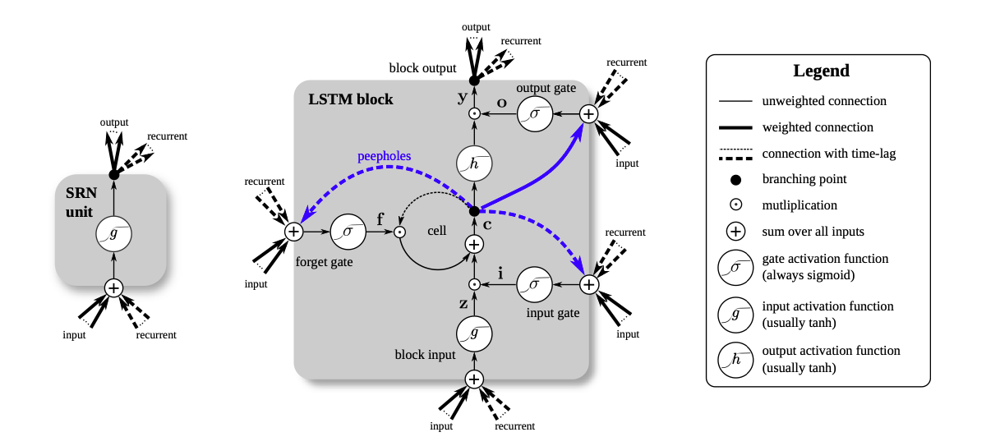
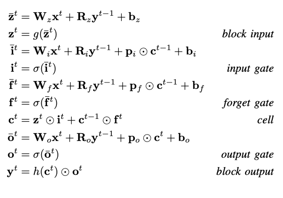

The [Long Short-Term Memory(LSTM) paper](https://www.bioinf.jku.at/publications/older/2604.pdf) introduces a novel recurrent
network architecture in conjunction with an appropriate gradient-based learning algorithm. LSTM network can learn to bridge time intervals in excess of 1000 steps even in case of noisy, incompressible input sequences, without loss of short time lag capabilities.

## Why LSTM?

### The Problem

#### Vanishing Gradients

When n hidden layers use an activation like the sigmoid function, n small derivatives are multiplied together. Thus, the gradient decreases exponentially as we propagate down to the initial layers.Since these initial layers are often crucial to recognizing the core elements of the input data. Therefore learning to bridge long time lags takes a prohibitive amount of time, or does not work at all.

### The Remedy

#### Memory cells and gate units

LSTM (Vanilla LSTM) is composed of a cell, multiplicative input gate unit and output gate. The cell remembers values over arbitriary time intervals and the gates regulate the flow of information into and out the cell by scaling them. The resulting, more complex unit is called a memory cell.

## Variants

### Forget Gate

The forget gate enables the LSTM to reset its own state. This allowed learning of continual tasks such as embedded Reber grammar.

### Peephole Connections

In order to learn precise timings, the cell needs to control the gates. So, peephole
connections were added to the architecture. Additionally, the output activation function was omitted, as there was no evidence that it was essential for solving the problems that LSTM had been tested on so far.

## Advantages

- Effective at capturing longterm temporal dependencies.
- Ability to bridge very long time lags.
- Can handle noise, distributed representations, and continuous values.
- Quickly learns to distinguish between two or more widely separated occurrences of a particular element in an input sequence.
- There appears to be no need for parameter fine tuning.
- Update complexity per weight and time step is essentially that of BPTT, namely O(1).

## Conclusion

Conclusion derived from testing different variants of LSTMs accross different datasets in different domains:

- Vanilla LSTMs perform reasonably well on various datasets.
- None of the 8 variants improved model performance significantly. However, NP and CIFG simplified the model and reduced computational complexity significantly.
- The Forget Gate, and the Output Activation Function are the most critical components of the LSTM.
- Output activation function is used to take care of the unbounded cell state.
- Learning Rate is the most important Hyper-Parameter.
- Hyper-Parameters are almost independent of each other in LSTMs.

