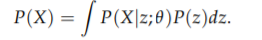
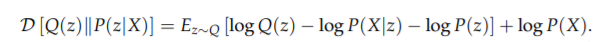
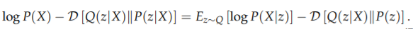
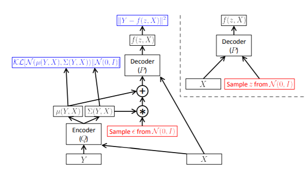

Common issues faced while using other encoding and decoding methods for generative models are: 

1) Either the assumptions about the correlation and structure of data used in the methods are too rigid.

2) Computation costs are large.

Variational auto-encoders use back propogation for encoding into a lower dimensional space, where we call the features as 'latent'.
It is quick, as it uses gradient descent, the method for generating a neural model.

For the training dataset, we aim to maximise the probablity of each X according to(using law of total prob.) through gradient descent : _________ eq(1)

This gives an intuition for 'maximum likelihood', promising it'll output similar datapoints if it's also likely to produce training set examples.

Encoding can be seen as data inference here, to result into a latent data features' layer.

##### <i>Side note:</i>  
Here, in VAEs, the probability function is Gaussian. It represents that the Z will produce data points that are <b>like</b> X.

#### Maximising equation 1:

Initial parameter we take for P(z) here is, a simple distribution of N(0,1) with an argument that `a normal distribution function can be mapped to any function using complicated mapping functions.`

We are obviously not going to hand pick latent features by observing the correlation between datapoints.(Except for some pre-processing required, if any).

While using gradient ascent (ascent because we need to maximise P), we need to keep in mind that `hyperparameter is set to a small value`, so that very unlikely samples contribute the least to our P(x) and extremely alike samples contribute significatly larger. 

#### Generating truncated function Q

Q takes the value of X and gives distribution over z, only which are likely to produce samples alike X.

Using KL divergence for expected value for difference in the probablity function and Q and substituing value of P(z|X) using Bayes, we get: (here, P(X) comes out as it does not depend on z) _________eq(2)

To make KL divergence smaller, Q must depend on X. Also, rearranging the equation gives: __________eq(3)

#### <i> Significance:</i>

- Here, we can maximise P(X) and minimise the KL divergence(error term) by optimising the RHS.

- RHS might also give one a sense of relation with auto-encoder model.

Next sections from hereby talk about Optimizing the method for achieving the objective, testing the model and interpreting the model and its significance. They also talk about conditional VAEs.

 I will talk about them in brief.

#### Optimising the objective

- We know that we need to evaluate the gradient of the RHS of the eq3. A problem is that expected value depends on Q too. Forward propogation will work fine, but during the bavk propogation, gradient will be invalid as Q might be non continuous. The solution is reparameterization trick, which is nothing but moving the sampling into an inner layer, by sampling from N(0,I) instead of sampling directly from N(mean(X), variance(X)).

#### Testing and interpreting the model

- After learning has finished, we can generate new datapoints by simply inputing z fromN(0,I) directly to the decoder, disregarding the encoder part.

- The error part (KL divergence) is zero in this scenario of low hyperparameter value. It is mentioned without proof.

#### Conditional VAEs

Here, we aim to generate samples with pre exisiting conditions, e.g. digit succeeding a string of handwritten digits. Regression models will fail for such multi-modal test cases. Normal VAE are also problematic as we have no control over data generation process.

We need to create a multimodal space to sample our data from. We wont need to restructure our regression model, but instead just preprocess the conditions, such that input to output mapping is one to many.

The extra variable here can be a conditional variable or a label.

<u>Note:</u> I have omitted the stuff which I couldn't comprehend yet. Still surfing around to learn more.
